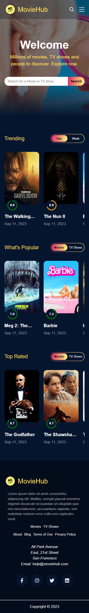
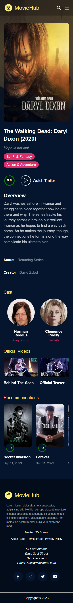

## Movie Hub :sparkles:

A responsive Single Page Application for listing Movies and TV shows built using ReactJS and Sass for styling. A beautiful user interface that allows users to browse, search and explore a wide collection of Movies and TV Shows fetched from TMDB API!

### Features :dart:

:small_blue_diamond: "Search" Button to search for a specific movie or tv show  
:small_blue_diamond: Sorting movies/tv shows based on genres, rating and popularity.  
:small_blue_diamond: 404 page to handle nonexistent routes  
:small_blue_diamond: Carousels with a toggle switch to switch between movies and tv shows for different categories.

### Packages Used :memo:

:high_brightness: Sass for styling  
:high_brightness: Axios  
:high_brightness: Redux Toolkit  
:high_brightness: React Router 6  
:high_brightness: React player  
:high_brightness: React Select  
:high_brightness: React Circular Progressbar  
:high_brightness: Lazy Image Load  
:high_brightness: Infinite Scroll  

 

<!--  -->

### Screenshots :point_down:

#### Home Page

| Desktop View                                 | Mobile View                                 |
| -------------------------------------------- | ------------------------------------------- |
|  |  |

#### Details Page

| Desktop View                                    | Mobile View                                    |
| ----------------------------------------------- | ---------------------------------------------- |
|  |  |
